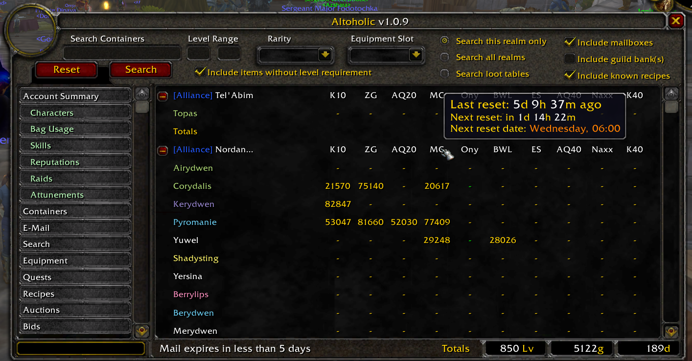
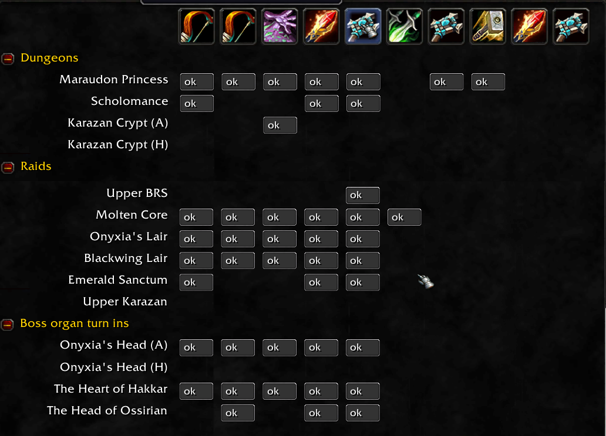

# Altoholic_Vanilla

This is my version for Turtle WOW. See the original README below.

This version fixes several bugs, improves some things, and adds a menu tab to show
Raid lockouts and reset times.

If you have several accounts, or cleared your WDB folder, a character might not know
some of the items in the auction/bid lists, which lead to crashes. Now those items
are shown as blank squares and requested from the server for future display.

Character lists are sorted by character level backwards, then name. So your level 60's
are always on top, and your level 1 bank characters are always on bottom.

The new character sort order also fixes the problem that sometimes clicking on a character
made a different character pop up (caused by LUA tables not preserving order).

The quest log messed up after a while, making quests show as header lines.

Reputations and Equipment are now limited to your 10 highest character; this was a problem
if you had more than 10 characters when you had more than 1 account.

Profession skills are shown with their first letter now, so "Jewelcrafting 300" shows as
"J300", not 300, which makes it easier to find a skill.

A new tab shows which characters have raid lockout IDs for which raid.
This includes reset times which are shown when you hover over a raid name in the title,
no more reason to tab out and use the (excellent!) turtle timers.

Added several Turtle specific factions to the factions list.

## Raid Module

A new module shows the raid IDs for your characters and their expiration times.
Hovering the mouse over a header shows the last reset and next reset times
for that raid, it also shows the next reset date as day of the week. So it's easy
for you to determine if you can go raid today when you need the ID for a
guild raid on saturday.

## Attunements Module

This module helps you to remember which of your character has dungeon keys,
completed attunement quests, and turned in one-time items (Onyxia head,
Hakkar heart etc.). It checks if you have done the corresponding quest, so it
also answers the question "has this character that I haven't played in half a
year done its BWL attunement or not?".

For dungeons, it checks quests as well, like whether or not you have done the
Scepter of Celebras quest for Maraudon or the Key to Scholomance. As the module
can only check quests, it will not tell you about the scarlet key or the Dire
Maul key.

As I don't know much about the higher tier raid, I'm open to suggestions as to
what other items/quests to include. A link to the corresponding quest on 
database.turtle-wow.org would be great if you want an addition here.

## Supporting multiple accounts

### Possible but difficult

If you have several accounts and want to share Altoholic data between them,
you must apply some windows tricks to make all accounts share the same data
file. This isn't supported by WOW itself.

It is going to become a bit technical here. I'll explain the process and what
happens, but you need to have some technical knowledge and experience with
using the command line. If you need more explanation than this, please don't
ask me, ask a friend who knows more. **I won't answer questions regarding this**,
but if you have suggestions on how to make this section more understandable,
feel free to ping.

### Behind the scenes

If you have two accounts named Alice and Bob, and your WOW installation is in
`C:\GAMES\Turtlewow`, then WOW stores all account data for Alice in
`C:\Games\Turtlewow\WTF\Account\ALICE`, and all data for Bob in
`C:\Games\Turtlewow\WTF\Account\BOB`. The accounts can't access each other's data.

The full names of the data files would be, in this case,
`C:\Games\Turtlewow\WTF\Account\ALICE\SavedVariables\Altoholic.lua`
and `C:\Games\Turtlewow\WTF\Account\BOB\SavedVariables\Altoholic.lua`.
Now, Windows has a feature called "symbolic link" which allows a file to point
to a different one. You can make a file named `C:\Games\Turtlewow\Altoholic.lua`
and tell Windows to actually access that file when one of the real ones gets
accessed. This is making
`C:\Games\Turtlewow\WTF\Account\ALICE\SavedVariables\Altoholic.lua` a symbolic
link to `C:\Games\Turtlewow\Altoholic.lua`, and the same for the BOB file.

When WOW saves variables, it renames the file to a `.bak` file unless the `.bak`
already exists, so we need to make sure the `.bak` exists before creating the
symlink, else the symlink will just be renamed.

The included script "make-altoholic-links.ps" should do all the technical stuff.
Start powershell as administrator (else it won't be able to create symlinks),
move to a folder that's "above" your `Account` folder, and run the script.

### Warnings

Also note that there will be issues if you run two accounts at once. The data
will be saved whenever you log out, overwriting everything from before.
Now imagine Alice and Bob each have 5 arcane essences. You log in both toons,
both will know about those 5 essences. Now Alice trades 3 essences to Bob and
logs out. At that time, the database will know that Alices essences are down to
3, but Bob doesn't reload that info. So Bob's Altoholic will know Bob has 8,
but think Alice has 5.

When you log out Bob, this info will be written to the common database, so you'll
see Alice-5 Bob-8 until you log in Alice again.

Also, if you log out a character in Account Alice, and the logout writes the 
database, and during that write you log in on Account Bob, the Bob account will
read an incomplete database and give you a warning. When Alice's log out is
complete, you'll have a working database on the disk, but the in-memory one of
Bob is botched. In this case, do *not* log out Bob; log Alice back in to read the
sane database, then log Bob out (will write the botched one), then log Alice out
(will overwrite the botched one with Alice's good one).

------------

Altoholic for Vanilla WoW 1.12 - backported from version 2.4.015 originally written by Thaoky

*Please Note:*
- Please use the <a href="https://github.com/Dyaxler/Altoholic_Vanilla/issues">issue tracker</a> to report bugs!

Screenshots:

Features:

- Language supported: English and French. Although it's not fully localized for frFR, it does run well on French clients (my guildmates made sure of this :D). More languages will come soon, I'm using the LibBabble libraries more & more.

- Account-wide data summary:
	- Characters' talents: only a summary, not a full buid, I may implement this later on if there's demand.
	- Money, /played, rest xp for each character, subtotals by realm, and grandtotals for the account.
	- Bag usage: see at a glance which characters should get bigger bags (bag size, free slots and types included)
	- Characters' skills: skill summary on one screen, namely the 2 main professions + the 3 secondary skills as well as riding. I may add more if there's demand.
	- Reputations: a list of all the reputations of the current realm's characters. This screen will get some love in the future, but it's perfectly functional. You can see at a glance if all your alts are at least honored with Honor Hold if you want to get the new 2.4 blue PVP set.

- View containers (bags, bank, keyring) of all alts, on all realms.

- Guild banks : You have 10 alts in 10 different guilds on the same server, all of them with access to a guild bank ?
Not a problem, you can see them all here.

- E-mail: allows you to see which alts have mail without having to reconnect them. The addon will tell you when mail is about to expire on a character. Threshold configurable (up to 15 days). Multiple realm support as well. Mails sent to a known alt (one you've logged on at least once) will be visible in the addon.

- Equipment: See the equipment of the current realm's alts in one screen. Very useful when purchasing stuff for your alts at the AH.

- Options: the option screen is still a bit minimal, I'll add more options along the way depending on user requests.

- Search: the most important feature of the addon, it uses an AH-like frame to display search results. You can either search bags on the current realm, on all realms, or a loot table.
The loot table is a table based on AtlasLoot 4.04 which contains only item id's, and therefore keeps memory usage minimal.
As an indicator, with 10 alts (+bank) + guild bank + loot table, the addon only takes 2.3 mb of memory. The addon has gained weight since the integration of some libraries, but this will ensure support for multiple languages in the future. I expect to support deDE soon.

The Search menu allows you to find items based on their name (even partial), level, type or rarity, almost like at the AH.

How to Install the addon
========================

Make sure you unzip the addon using "Extract Here" instead of "Extract to Altoholic v2.x.yyy", otherwise the resulting directory will contain a space that will prevent the addon from being visible in WoW's addon list.

Using command-line searches
===========================

Type: /alto search <item>
ex: 
/alto search cloth
/alto search primal
...

A maximum of two words is allowed after the command, so you could type:
/alto search primal mana 		... and get only those primals in the search results.
This should cover most of the searches you can do via the command line, if you actually need something more complicated, please use the UI.
